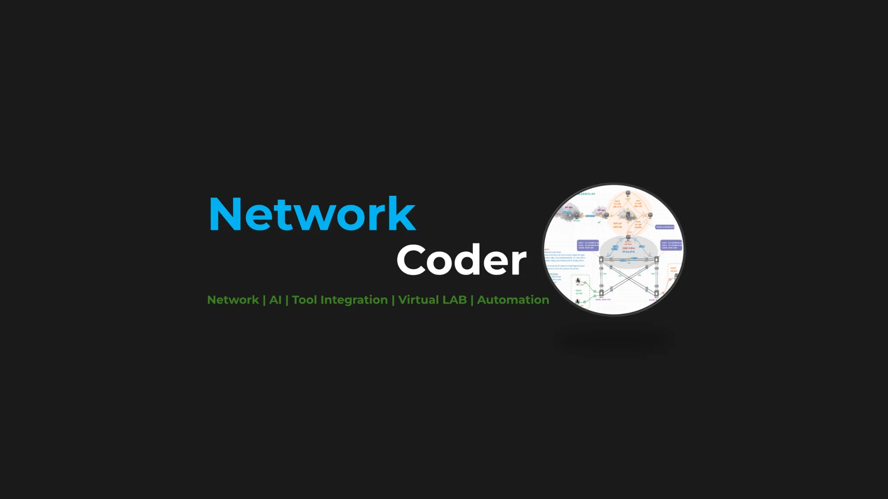

# 🚀 Network Automation Series

<p align="center">
  
</p>

<p align="center">
  
  
  
  
  
</p>

<p align="center">
  <a href="https://youtube.com/@NetworkCoder"></a>
  <a href="https://www.linkedin.com/in/hadeek"></a>
  <a href="https://github.com/network-tocoder"></a>
</p>
---

## 🎓 What You'll Learn

This series takes you from zero to hero in network automation. Build a complete virtual lab, automate firewalls, deploy NetBox for infrastructure management, and integrate everything with modern DevOps tools.

---

## 📺 Video Index

| # | Video | Topic | 🎬 Watch |
|---|-------|-------|----------|
| 1 | [EVE-NG Installation](#video-1-eve-ng-installation--first-virtual-lab) | EVE-NG, Virtual Lab Setup | [▶️ YouTube](https://www.youtube.com/watch?v=ABNOS7GypxA) |
| 2 | [Build Automation Environment](#video-2-build-automation-environment-inside-eve-ng) | Linux, Ansible, VS Code | [▶️ YouTube](https://www.youtube.com/watch?v=NPq7AjCguBY) |
| 3 | [Git Workflow](#video-3-git-workflow-for-network-engineers) | Git, GitHub, Version Control | [▶️ YouTube](https://www.youtube.com/watch?v=vykDi7PFeW0) |
| 4 | [Deploy FortiGate](#video-4-deploy-fortigate-firewall-on-eve-ng) | FortiGate, EVE-NG | [▶️ YouTube](https://www.youtube.com/watch?v=8W9OJAP773s) |
| 5 | [FortiGate Ansible](#video-5-fortigate-firewall-using-ansible) | Ansible, FortiGate, Vault | [▶️ YouTube](https://www.youtube.com/watch?v=3VL-JRIJT8M) |
| 6 | [FortiGate REST API](#video-6-fortigate-automation-using-rest-api) | REST API, Postman | [▶️ YouTube](https://www.youtube.com/watch?v=Eqy4q9SsmtE) |
| 7 | [NetBox Docker](#video-7-netbox-installation-using-docker) | NetBox, Docker | [▶️ YouTube](https://www.youtube.com/watch?v=OGQGly7NIFY) |
| 8 | [NetBox Dynamic Inventory](#video-8-netbox-dynamic-inventory---core-concepts-explained) | DIODE, ORB, Architecture | [▶️ YouTube](https://www.youtube.com/watch?v=JZ-jDCT8mQY) |
| 9 | [NetBox Auto-Discovery](#video-9-netbox-auto-discovery---complete-setup-guide) | DIODE, ORB Agent, OAuth | [▶️ YouTube](https://www.youtube.com/watch?v=DODzEsMTmKQ) |
| 10 | [pyATS + NetBox](#video-10-pyats--netbox-integration) | pyATS, Testing, NetBox | [▶️ YouTube](https://www.youtube.com/watch?v=V_PmWxC2QDA) |
| 11 | [NetBox + MCP Integration](#video-11-netbox--mcp-integration) | MCP, Claude Code, AI | [▶️ YouTube](https://www.youtube.com/watch?v=YOUR_VIDEO_ID) |

---

## 🛠️ Tech Stack


---

## Video 1: EVE-NG Installation & First Virtual Lab

[▶️ Watch on YouTube](https://www.youtube.com/watch?v=ABNOS7GypxA)

### 📋 Overview

Install EVE-NG on VMware Workstation and build your first virtual network topology.

### 💻 Commands

<details>
<summary>EVE-NG Initial Setup</summary>

```bash
# Update EVE-NG
apt update && apt upgrade -y

# Fix permissions (run after adding images)
/opt/unetlab/wrappers/unl_wrapper -a fixpermissions
```

</details>

---

## Video 2: Build Automation Environment Inside EVE-NG

[▶️ Watch on YouTube](https://www.youtube.com/watch?v=NPq7AjCguBY)

### 📋 Overview

Deploy Linux node in EVE-NG, install Ansible, and integrate VS Code.

### 💻 Commands

<details>
<summary>1. System Setup</summary>

```bash
# Update system
sudo apt update && sudo apt upgrade -y

# Install Python and pip
sudo apt install python3 python3-pip python3-venv -y
```

</details>

<details>
<summary>2. Create Virtual Environment & Install Ansible</summary>

```bash
# Create virtual environment
python3 -m venv ~/ansible-venv

# Activate virtual environment
source ~/ansible-venv/bin/activate

# Upgrade pip
pip install --upgrade pip

# Install Ansible
pip install ansible

# Verify installation
ansible --version
```

</details>

<details>
<summary>3. VS Code Remote SSH Setup</summary>

```bash
# Install OpenSSH Server
sudo apt install openssh-server -y

# Start SSH service
sudo systemctl start ssh
sudo systemctl enable ssh

# Get IP address for VS Code connection
ip addr show
```

</details>

---

## Video 3: Git Workflow for Network Engineers

[▶️ Watch on YouTube](https://www.youtube.com/watch?v=vykDi7PFeW0)

### 📋 Overview

Complete Git workflow for version controlling network automation projects.

### 💻 Commands

<details>
<summary>1. Git Installation & Configuration</summary>

```bash
# Install Git
sudo apt install git -y

# Configure Git identity
git config --global user.name "Your Name"
git config --global user.email "your.email@example.com"

# Verify configuration
git config --list
```

</details>

<details>
<summary>2. SSH Key for GitHub</summary>

```bash
# Generate SSH key
ssh-keygen -t ed25519 -C "your.email@example.com"

# Start SSH agent
eval "$(ssh-agent -s)"

# Add key to agent
ssh-add ~/.ssh/id_ed25519

# Copy public key (add to GitHub)
cat ~/.ssh/id_ed25519.pub

# Test GitHub connection
ssh -T git@github.com
```

</details>

<details>
<summary>3. Git Workflow Commands</summary>

```bash
# Clone repository
git clone git@github.com:username/repo.git
cd repo

# Create and switch to new branch
git checkout -b feature-branch

# Stage changes
git add .

# Commit changes
git commit -m "Description of changes"

# Push to remote
git push origin feature-branch

# Pull latest changes
git pull origin main
```

</details>

---

## Video 4: Deploy FortiGate Firewall on EVE-NG

[▶️ Watch on YouTube](https://www.youtube.com/watch?v=8W9OJAP773s)

### 📋 Overview

FortiGate installation in virtual lab and network security device configuration.

### 💻 Commands

<details>
<summary>FortiGate Initial Setup</summary>

```bash
# EVE-NG: Fix permissions after adding FortiGate image
/opt/unetlab/wrappers/unl_wrapper -a fixpermissions

# FortiGate CLI: Show system status
get system status

# Configure management interface
config system interface
    edit port1
        set ip 192.168.1.99/24
        set allowaccess ping https ssh http
    next
end

# Set default gateway
config router static
    edit 1
        set gateway 192.168.1.1
        set device port1
    next
end
```

</details>

---

## Video 5: FortiGate Firewall Using Ansible

[▶️ Watch on YouTube](https://www.youtube.com/watch?v=3VL-JRIJT8M)

### 📋 Overview

Install Ansible Collections for FortiGate, configure Ansible Vault, and run automation playbooks.

### 💻 Commands

<details>
<summary>1. Install FortiGate Ansible Collection</summary>

```bash
# Activate virtual environment
source ~/ansible-venv/bin/activate

# Install FortiOS collection
ansible-galaxy collection install fortinet.fortios

# Verify installation
ansible-galaxy collection list | grep fortinet
```

</details>

<details>
<summary>2. Ansible Vault Setup</summary>

```bash
# Create vault password file
echo "YourVaultPassword" > ~/.vault_pass
chmod 600 ~/.vault_pass

# Create encrypted variables file
ansible-vault create group_vars/all/vault.yml --vault-password-file ~/.vault_pass

# Add credentials to vault.yml:
# vault_fortigate_user: admin
# vault_fortigate_password: your_password
# vault_fortigate_token: your_api_token

# Edit vault file
ansible-vault edit group_vars/all/vault.yml --vault-password-file ~/.vault_pass
```

</details>

<details>
<summary>3. Run Playbooks</summary>

```bash
# Run playbook with vault
ansible-playbook playbooks/fortigate_info.yml --vault-password-file ~/.vault_pass

# Run firewall policy playbook
ansible-playbook playbooks/fortigate_policy.yml --vault-password-file ~/.vault_pass
```

</details>

---

## Video 6: FortiGate Automation Using REST API

[▶️ Watch on YouTube](https://www.youtube.com/watch?v=Eqy4q9SsmtE)

### 📋 Overview

REST API automation with Postman and VS Code integration for firewall configurations.

### 💻 Commands

<details>
<summary>1. Generate API Token on FortiGate</summary>

```bash
# FortiGate CLI: Create API admin user
config system api-user
    edit "api_user"
        set accprofile "super_admin"
        set vdom "root"
        config trusthost
            edit 1
                set ipv4-trusthost 192.168.1.0/24
            next
        end
    next
end

# Generate API token
execute api-user generate-key api_user
```

</details>

<details>
<summary>2. curl API Examples</summary>

```bash
# Get system status
curl -k -X GET "https://192.168.1.99/api/v2/monitor/system/status" \
  -H "Authorization: Bearer YOUR_API_TOKEN"

# Get firewall policies
curl -k -X GET "https://192.168.1.99/api/v2/cmdb/firewall/policy" \
  -H "Authorization: Bearer YOUR_API_TOKEN"

# Create firewall address object
curl -k -X POST "https://192.168.1.99/api/v2/cmdb/firewall/address" \
  -H "Authorization: Bearer YOUR_API_TOKEN" \
  -H "Content-Type: application/json" \
  -d '{
    "name": "Test_Server",
    "subnet": "10.0.0.10/32"
  }'
```

</details>

---

## Video 7: NetBox Installation Using Docker

[▶️ Watch on YouTube](https://www.youtube.com/watch?v=OGQGly7NIFY)

### 📋 Overview

Deploy NetBox with Docker Compose for infrastructure documentation.

### 💻 Commands

<details>
<summary>1. Install Docker</summary>

```bash
# Install Docker and Docker Compose
sudo apt install -y docker.io docker-compose

# Start Docker service
sudo systemctl start docker
sudo systemctl enable docker

# Add user to docker group
sudo usermod -aG docker $USER

# Verify installation (logout/login first)
docker --version
docker-compose --version
```

</details>

<details>
<summary>2. Deploy NetBox</summary>

```bash
# Clone NetBox Docker repository
git clone -b release https://github.com/netbox-community/netbox-docker.git
cd netbox-docker

# Create override file for port mapping
cp docker-compose.override.yml.example docker-compose.override.yml

# Pull images
docker-compose pull

# Start NetBox stack
docker-compose up -d

# Check status
docker-compose ps

# Verify port 8000 is listening
ss -tuln | grep :8000
```

</details>

<details>
<summary>3. Create Superuser</summary>

```bash
# Create admin user
docker-compose exec netbox /opt/netbox/netbox/manage.py createsuperuser
```

</details>

Access NetBox: `http://your-ip:8000`

---

## Video 8: NetBox Dynamic Inventory - Core Concepts Explained

[▶️ Watch on YouTube](https://www.youtube.com/watch?v=JZ-jDCT8mQY)

### 📋 Overview

Architecture overview of the auto-discovery stack: ORB, DIODE, and NetBox working together.

### 🏗️ Architecture

```
┌─────────────┐     ┌─────────────┐     ┌─────────────┐
│  Network    │────▶│    ORB      │────▶│   DIODE     │────▶│  NetBox   │
│  Devices    │     │   Agent     │     │   Server    │     │           │
└─────────────┘     └─────────────┘     └─────────────┘     └───────────┘
     NAPALM              OAuth              REST API          Source of
     Discovery           Tokens             Ingest            Truth
```

---

## Video 9: NetBox Auto-Discovery - Complete Setup Guide

[▶️ Watch on YouTube](https://www.youtube.com/watch?v=DODzEsMTmKQ)

### 📋 Overview

Complete setup guide for NetBox auto-discovery with DIODE and ORB Agent.

### 💻 Commands

<details>
<summary>1. Clone and Start DIODE</summary>

```bash
# Clone DIODE quickstart repository
git clone https://github.com/netboxlabs/diode-quickstart.git
cd diode-quickstart

# Start DIODE stack (includes Hydra for OAuth)
docker-compose up -d

# Verify containers
docker-compose ps
```

</details>

<details>
<summary>2. Install NetBox DIODE Plugin</summary>

```bash
# In netbox-docker directory, edit docker-compose.override.yml
cd ~/netbox-docker

# Add to netbox service environment:
# PLUGINS: netbox_diode_plugin

# Add to requirements.txt or plugins.py:
# netbox-diode-plugin

# Restart NetBox
docker-compose down
docker-compose up -d
```

</details>

<details>
<summary>3. Configure ORB Agent</summary>

Create `config.yaml`:

```yaml
orb:
  agent_name: "network-discovery"
  
diode:
  target: "grpc://192.168.1.120:8081"
  api_key: "your-diode-api-key"

discovery:
  networks:
    - name: "lab-network"
      targets:
        - hostname: "192.168.1.201"
          driver: "ios"
          username: "admin"
          password: "cisco"
          optional_args:
            secret: "cisco"
```

</details>

<details>
<summary>4. Run ORB Agent</summary>

```bash
# Install ORB agent
pip install orb-agent

# Run discovery
orb-agent run --config config.yaml
```

</details>

---

## Video 10: pyATS + NetBox Integration

[▶️ Watch on YouTube](https://www.youtube.com/watch?v=V_PmWxC2QDA)

### 📋 Overview

Network testing with pyATS and automated inventory sync with NetBox.

### 💻 Commands

<details>
<summary>1. Install pyATS</summary>

```bash
# Create virtual environment
python3 -m venv ~/pyats-env
source ~/pyats-env/bin/activate

# Install pyATS with all packages
pip install "pyats[full]"

# Verify installation
pyats version check
```

</details>

<details>
<summary>2. Set Environment Variables</summary>

```bash
# Add to ~/.bashrc
export NETBOX_URL="http://192.168.1.120:8000"
export NETBOX_TOKEN="your-netbox-api-token"
export PYATS_USERNAME="admin"
export PYATS_PASSWORD="cisco"

# Reload bashrc
source ~/.bashrc
```

</details>

<details>
<summary>3. Create Testbed from NetBox</summary>

```bash
# Install pyATS NetBox plugin
pip install pyats-netbox

# Generate testbed from NetBox
pyats create testbed netbox \
  --url $NETBOX_URL \
  --token $NETBOX_TOKEN \
  --output testbed.yaml

# Verify testbed
cat testbed.yaml
```

</details>

<details>
<summary>4. Run pyATS Tests</summary>

```bash
# Interactive shell
pyats shell --testbed testbed.yaml

# Parse command output
pyats parse "show version" --testbed testbed.yaml --device router1

# Learn feature
pyats learn interface --testbed testbed.yaml --device router1

# Run job
pyats run job my_job.py --testbed testbed.yaml
```

</details>

### 📝 Sample Testbed (testbed.yaml)

```yaml
testbed:
  name: Network-Lab

devices:
  R1:
    os: ios
    type: router
    connections:
      defaults:
        class: unicon.Unicon
      ssh:
        protocol: ssh
        ip: 192.168.1.201
    credentials:
      default:
        username: "%ENV{PYATS_USERNAME}"
        password: "%ENV{PYATS_PASSWORD}"
```

---

## Video 11: NetBox + MCP Integration

[▶️ Watch on YouTube](https://www.youtube.com/watch?v=YOUR_VIDEO_ID)

### 📋 Overview

Connect Claude AI to NetBox using Model Context Protocol (MCP) for natural language infrastructure queries.

### 🎯 What You'll Learn

- What is MCP (Model Context Protocol)
- MCP architecture and connectivity methods
- Install Claude Code CLI on Linux
- Setup NetBox MCP Server
- Query NetBox using natural language

### 🏗️ Architecture

```
┌─────────────────┐     ┌─────────────────┐     ┌─────────────────┐
│  Claude Code    │────▶│   MCP Server    │────▶│     NetBox      │
│  (AI Assistant) │◀────│   (Bridge)      │◀────│     (API)       │
└─────────────────┘     └─────────────────┘     └─────────────────┘
     Natural               Translates            Returns
     Language              to API calls          Data
```

### 💻 Commands

<details>
<summary>1. Install Node.js 20+</summary>

```bash
# Add NodeSource repository
curl -fsSL https://deb.nodesource.com/setup_20.x | sudo -E bash -

# Install Node.js
sudo apt install -y nodejs

# Verify installation
node --version    # Should show v20.x.x
npm --version     # Should show 10.x.x
```

</details>

<details>
<summary>2. Install Claude Code CLI</summary>

```bash
# Install Claude Code globally
sudo npm install -g @anthropic-ai/claude-code

# Verify installation
claude --version
```

</details>

<details>
<summary>3. Install UV (Python Package Manager)</summary>

```bash
# Install uv
curl -LsSf https://astral.sh/uv/install.sh | sh

# Add to PATH
source $HOME/.local/bin/env

# Verify installation
uv --version
```

</details>

<details>
<summary>4. Clone NetBox MCP Server</summary>

```bash
# Create MCP servers directory
mkdir -p ~/mcp-servers && cd ~/mcp-servers

# Clone official NetBox MCP server
git clone https://github.com/netboxlabs/netbox-mcp-server.git
cd netbox-mcp-server

# Install dependencies
uv sync
```

</details>

<details>
<summary>5. Test MCP Server Connection</summary>

```bash
# Test MCP server (replace with your NetBox URL and token)
NETBOX_URL=http://192.168.1.120:8000/ \
NETBOX_TOKEN=your-netbox-api-token \
uv run netbox-mcp-server

# Press Ctrl+C to stop after confirming it starts
```

</details>

<details>
<summary>6. Configure Claude Code with MCP</summary>

```bash
# Add NetBox MCP server to Claude Code
claude mcp add netbox \
  -e NETBOX_URL=http://192.168.1.120:8000/ \
  -e NETBOX_TOKEN=your-netbox-api-token \
  -- uv --directory ~/mcp-servers/netbox-mcp-server run netbox-mcp-server

# Verify MCP server is added
claude mcp list
```

</details>

<details>
<summary>7. Start Claude Code</summary>

```bash
# Launch Claude Code CLI
claude

# You can now ask natural language questions about your NetBox data:
# "What devices are in my network?"
# "Show me all IP addresses in the 10.0.0.0/24 subnet"
# "What's connected to switch-core-01?"
```

</details>

### 🔗 Resources

- [NetBox MCP Server](https://github.com/netboxlabs/netbox-mcp-server)
- [Claude Code](https://claude.ai/download)
- [FastMCP Documentation](https://gofastmcp.com)

---

## 📚 Additional Resources

| Resource | Link |
|----------|------|
| EVE-NG | [eve-ng.net](https://www.eve-ng.net/) |
| NetBox | [netbox.dev](https://netbox.dev/) |
| Ansible Docs | [docs.ansible.com](https://docs.ansible.com/) |
| Docker Docs | [docs.docker.com](https://docs.docker.com/) |
| Fortinet Docs | [docs.fortinet.com](https://docs.fortinet.com/) |
| pyATS Docs | [developer.cisco.com/pyats](https://developer.cisco.com/docs/pyats/) |
| MCP Protocol | [modelcontextprotocol.io](https://modelcontextprotocol.io/) |

---

## 🤝 Connect With Me

[](https://youtube.com/@NetworkCoder)
[](https://linkedin.com/in/hadeek)

---

## 📄 License

This project is licensed under the MIT License - see the [LICENSE](LICENSE) file for details.

---

⭐ **If you find this helpful, please star the repo!** ⭐
